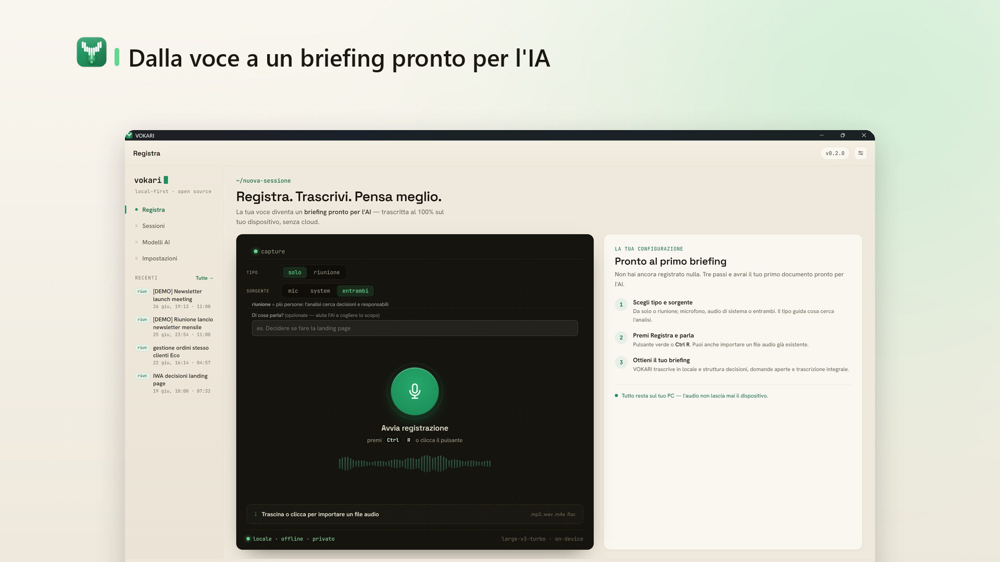
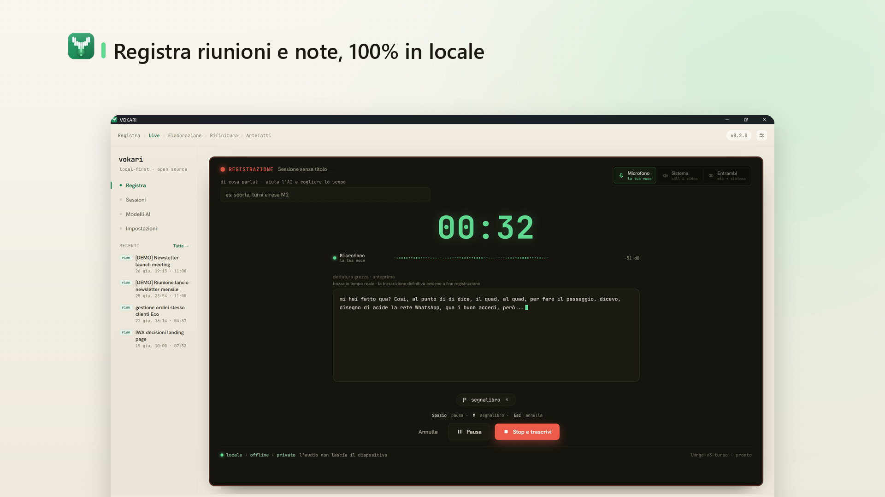
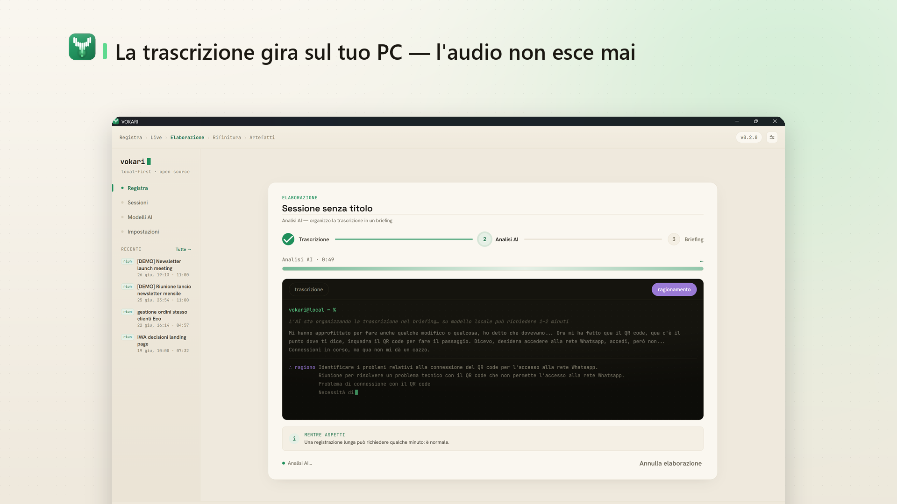
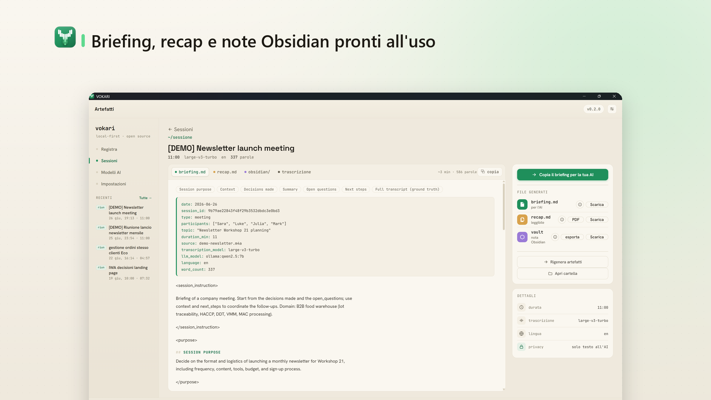
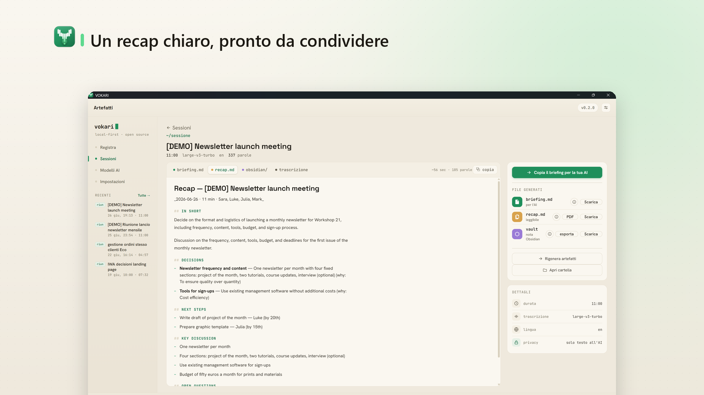
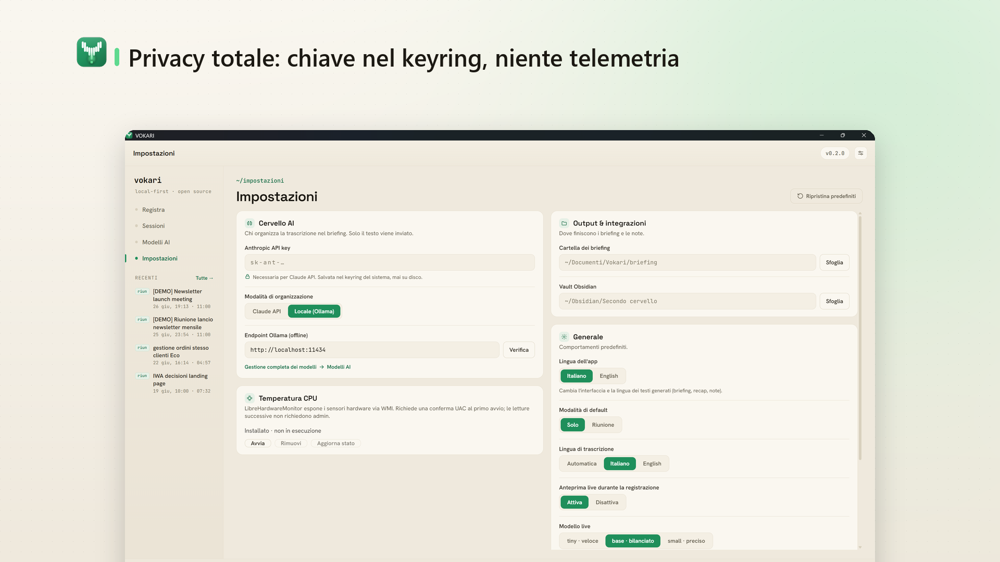

# VOKARI — Voce → Conoscenza

> Turn a voice recording into structured knowledge. **100% local** transcription, AI analysis, and Markdown artifacts for your second brain.


<p align="center">
  
</p>

**VOKARI** is a local-first Windows desktop app: record or import audio, transcribe it on-device with [faster-whisper](https://github.com/SYSTRAN/faster-whisper), analyze the text with Claude or a local Ollama model, and get clean Markdown artifacts — a `briefing.md` optimized for LLMs, a human-readable recap (+PDF), and atomic Obsidian notes.

**Your audio never leaves your machine** — only the transcribed *text* is sent to the AI, and even that stays local if you choose Ollama.

- 🎤 **Record** (mic, system audio, or both) or **import** any audio file
- 📝 **On-device transcription** — faster-whisper, no cloud
- 🧠 **Analysis** — Claude API or local Ollama
- 📦 **Output** — `briefing.md` + recap + PDF + Obsidian notes
- 🔐 **Privacy-first** — audio stays on your device; secrets live in the OS keyring ([Privacy policy](PRIVACY.md))
- 🌍 **Fully bilingual** — switch the whole app between **English** and **Italian**: not just the UI, but the AI-generated output too (briefing, recap, Obsidian notes, messages)

**Status:** v0.2.0 — the full flow works and is CI-gated (720+ automated tests: ~549 backend with pytest, ~173 frontend with vitest).

---

## 📥 Installation

### 📦 Packaged build (easiest)

Grab the latest **`VOKARI-vX.Y.Z.zip`** from the **[Releases](https://github.com/salvoclemenza-hub/vokari/releases)** page — it bundles an embedded Python runtime, ffmpeg, and the built UI, so **no toolchain is required**.

1. **Download** the ZIP from Releases.
2. **Unblock it first** — right-click the downloaded ZIP → **Properties** → tick **Unblock** → **OK**. *(One click, and it prevents the Windows 11 block described below.)*
3. **Extract** the ZIP anywhere.
4. Run **`INSTALLA.bat`** — installs to your user folder (`%LOCALAPPDATA%`, no admin needed) and creates a desktop shortcut.
5. Launch **VOKARI** from the desktop.

AI models (faster-whisper — and Ollama, if you pick it) download automatically on first use.

> ⚠️ **Windows 11 Smart App Control (SAC).** On a *minority* of PCs (clean installs of Windows 11) SAC is ON and blocks files downloaded from the internet — **including scripts** — with no "Run anyway" button. If you hit that block, either **unblock the ZIP before extracting** (step 2) or temporarily turn SAC off: *Windows Security → App & browser control → Smart App Control → Off*, install, then turn it back on. Most PCs (upgrades from Windows 10) have SAC **off** and just work.
>
> 🎯 **Microsoft Store — submitted & in certification.** The **v0.2.0** MSIX package has been submitted to the Microsoft Store and is currently going through certification. Once published it installs with **zero warnings** — Microsoft re-signs Store packages and SAC trusts them by design — so no unblocking is needed. (Not live yet; this is the frictionless path coming as soon as certification clears.)

### 🛠 Developer setup (works today)

Requirements: **Python 3.12+** (or [`uv`](https://docs.astral.sh/uv/)), **[pnpm](https://pnpm.io/)**, **[ffmpeg](https://ffmpeg.org/)** in your `PATH`, and a **Claude API key** (or a local Ollama install).

```bash
git clone https://github.com/salvoclemenza-hub/vokari.git && cd vokari

uv sync                                   # Python deps → .venv
cd frontend && pnpm install && pnpm build && cd ..

"Avvia VOKARI.bat"                        # Windows — rebuilds the UI if needed, then opens the app
# or, manually:  uv run python app/main.py
```

ffmpeg on Windows: `winget install ffmpeg` (or `choco install ffmpeg`).

---

## 🚀 Guida rapida all'uso (Italiano)

*Per chi deve semplicemente usare VOKARI, una volta che è avviata.*

1. **Chiave API** — apri **Impostazioni** e incolla la tua chiave Claude (la ottieni su [console.anthropic.com](https://console.anthropic.com) → *API keys*). La chiave viene salvata nel **keyring di Windows**, mai in un file. In alternativa puoi usare **Ollama** in locale: nessuna chiave, nessun costo, tutto sul tuo PC.
2. **Registra o importa** — dalla **Home** scegli *Registra* (microfono, audio di sistema, o entrambi) oppure *Importa* un file audio già esistente.
3. **Trascrizione** — parte in automatico ed è **locale**. Per circa un'ora di audio servono ~5–15 minuti su CPU.
4. **Intervista (opzionale)** — VOKARI propone 3–5 domande per chiarire i punti aperti: puoi rispondere o saltare. Le risposte vengono integrate nel briefing.
5. **Artefatti** — ottieni **`briefing.md`** (pensato per essere dato in pasto a un'altra AI), un **recap** leggibile (+PDF) e, se l'hai configurato, le **note Obsidian**. La cartella di destinazione si imposta in *Impostazioni → Cartella briefing*; ogni sessione resta archiviata e ricercabile nella libreria **Sessioni**.

> 💡 La prima volta che usi un modello di trascrizione, VOKARI lo scarica (da qualche centinaio di MB fino a ~1.6 GB per i modelli grandi). Succede una sola volta.

---

## 📸 Screenshots

| Live recording | Processing |
| :---: | :---: |
|  |  |

| Artifacts — `briefing.md` | Artifacts — recap |
| :---: | :---: |
|  |  |

| Settings | |
| :---: | :---: |
|  | |

> 🌍 English-language screenshots are available in [`screenshots/en/`](screenshots/en/) (same file names).

---

## ✨ Features

**Recording & import** — mic, system audio (Windows WASAPI loopback), both mixed, or import any file. Live transcription preview while you record.

**Processing** — streaming transcription with faster-whisper on CPU (works on AMD too); automatic model download (`large-v3-turbo` by default — fast; switch to `large-v3` for maximum accuracy); hash-based cache, so re-processing the same audio is instant.

**Long-audio handling** — long recordings are split into **overlapping chunks with dedup**, so sentences are never cut at segment boundaries. A **disk-space preflight** runs before recording to make sure there's room to capture.

**Transcript review & editing** — before the analysis runs, you can review and correct the transcript (fix mis-heard names or domain terms) so the briefing starts from clean text.

**Smart model-fit gate** — if the transcript is too long for the model's context window, VOKARI warns you and asks for confirmation **before** summarizing it in a lossy way, instead of silently truncating.

**Analysis & artifacts**
- **`briefing.md`** — YAML frontmatter (date, session ID, type, duration, LLM model), context · decisions · summary · open questions, the raw transcript for ground truth, `[TO CLARIFY: ...]` markers for skipped interview questions, and a next-steps checklist.
- **`recap.md`** — human-readable summary · **PDF export** for sharing · **Obsidian export** — atomic notes for your vault.

**Interview with live draft** — auto-detects 3–5 key questions from the transcript; skip or answer. While you do, a **live draft of the briefing** forms alongside the questions, and an "add more context" free-text field lets you feed extra guidance to the analysis. Responses and context are merged back into the final briefing.

**App language** — switch the entire app between **English** and **Italian** from Settings; it drives the UI *and* the AI-generated output (the LLM writes in the chosen language regardless of the spoken audio). Separate from the transcription language.

**Settings** — app language (English / Italian), LLM brain (Claude / Ollama), API key in OS keyring, default session type (*solo* brainstorm / *riunione* meeting), briefing folder, Obsidian vault, Whisper model + download progress, transcription language (auto / IT / EN), and a **"your context"** field where you describe your domain/context — used to guide the analysis and improve transcription.

**Sessions library** — persistent storage, full-text search, filtering by type.

---

## 🏗 Architecture

Three components organized by **responsibility**, not by technical layer — zero cloud dependencies (Claude API is optional, only if you pick that brain).

### Engine (`src/vokari/`) — library + CLI
- **audio/** — capture (sounddevice mic + WASAPI system audio + mix) → WAV 16k mono
- **transcribe/** — faster-whisper + caching + model management
- **llm/** — Claude or Ollama, behind a single Protocol (`factory.make_provider`)
- **analyze/** — transcript → structured JSON (pydantic schema) + interview
- **render/** — JSON → briefing.md / recap / Obsidian / PDF
- **store/** — sessions persistence + full-text search

CLI: `vokari transcribe audio.wav` · `vokari brief audio.wav` · `vokari rec`

### App host (`app/`) — pywebview shell
- **main.py** — opens the GUI window, serves the compiled `frontend/dist/`
- **api.py** — Python methods callable from JS (`window.pywebview.api`)
- **jobs.py** — `Job` + `JobStore` for persistent state + resume-on-crash
- **pipeline.py** — orchestrates transcribe → analyze → interview → render

### Frontend (`frontend/`) — React + TypeScript + Vite → `dist/`
- **9 screens** — Home, Live, Processing, Interview, Artifacts, Sessions, Models, Settings, Error
- Shared chrome (Titlebar + Sidebar + StatusBar); custom CSS design system
- Real-time push events (`audio_level`, `transcribe_progress`, `analysis_preview`, …) — no polling

---

## 🧪 Development

> **Golden rule:** pywebview serves the **compiled** `frontend/dist/`, not the source. After editing `frontend/src/`, run `cd frontend && pnpm build` (or just relaunch — `Avvia VOKARI.bat` rebuilds when sources are newer than `dist/`).

```bash
# Backend (Python)
uv run pytest                  # test suite
uv run ruff check              # lint

# Frontend (JS/TS)
cd frontend && pnpm test       # vitest
cd frontend && pnpm exec tsc -b   # strict type check
cd frontend && pnpm build      # bundle

# End-to-end, headless (no GUI)
uv run python scripts/e2e_smoke.py your-audio.m4a
```

---

## 🔐 Privacy & Security

- ✅ **Audio never leaves your device** — all processing is local (ffmpeg + faster-whisper on CPU)
- ✅ **API key in the OS keyring** — never in files, never in git
- ✅ **Only transcript text reaches the LLM** — and nothing leaves the machine at all with Ollama
- ✅ **No telemetry** — no tracking, no analytics
- ✅ **Open source** — MIT, fully auditable

---

## 🗺 Roadmap

- ✅ **v1** — local transcription + briefing + recap + Obsidian export (done)
- ✅ **v0.2.0** — packaged Windows release (ZIP/setup), full EN/IT i18n, transcript editing, interview live draft, model-fit gate, long-audio handling (done)
- 📦 **Microsoft Store** — MSIX **submitted & in certification**; zero-warning install once published
- 📋 **v2** — macOS/Linux system-audio capture · speaker attribution · RAG over your vault · batch / watch-folder
- 🤖 **v3** — sentiment analysis, action-item extraction, multi-LLM comparison

---

## 🩹 Troubleshooting

**"After I edit the frontend, nothing changes"** — pywebview serves the compiled `frontend/dist/`. Run `cd frontend && pnpm build` (or restart; the launcher rebuilds automatically).

**"System audio isn't captured (Windows)"** — WASAPI loopback needs a playing output device. Use *Both* (it falls back to mic if the system lane is silent), or capture mic only.

**"Transcription is very slow"** — `large-v3-turbo` (the default) is small and fast; prefer it for long audio. Switch to `large-v3` in *Settings → Models* only when you need maximum accuracy (first download ~2 GB).

**"The Claude API key won't save"** — VOKARI uses the OS keyring. Make sure Windows Credential Manager is accessible, then restart and try again. (Or switch to Ollama, which needs no key.)

---

## 📄 License

[MIT](LICENSE) — use freely, modify, redistribute.

## 🙏 Credits

A personal project designed and built by **Salvo Clemenza**.

Standing on the shoulders of:
- **[faster-whisper](https://github.com/SYSTRAN/faster-whisper)** — OpenAI Whisper via CTranslate2 (efficient CPU inference)
- **[Claude API](https://www.anthropic.com/)** — Anthropic
- **[pywebview](https://pywebview.flowrl.com/)** + **React** + **Vite**

---

**Questions or bugs?** [Open an issue](https://github.com/salvoclemenza-hub/vokari/issues).
